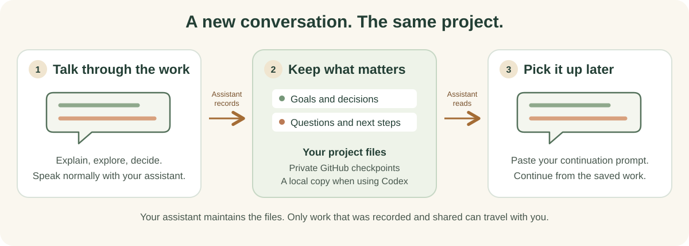

# Seedbag


A project can outlast its conversation. You have already explained the goal, ruled out ideas, made decisions, and left work unfinished. Starting another chat should not mean reconstructing all of that.

Seedbag keeps project records that your assistant updates as you work: goals, decisions and their reasons, ideas saved for later, open questions, next steps, and checks supporting completed work.



You describe the work normally. The assistant maintains the files and saves checkpoints to **your project's private GitHub repository**. A continuation prompt helps the next conversation find those files and recover the saved context.

On your computer, the assistant works in a local folder. A cloud conversation can also create and continue the project when it has the required tools and private GitHub access. Both use the same project repository. This public Seedbag repository supplies the starting framework; it does not store your project.

## Start a new project

Copy this prompt into your AI conversation. Replace **PROJECTNAME** with your project's name.

```text
Create a new private project called PROJECTNAME with its own private GitHub repository under my account, using https://github.com/Bhuteshwaraya/Seedbag.

Resolve the published v0.4.0 release to one exact commit. Read START_HERE.md there, follow its setup instructions, and use that same commit throughout.

If you can access my computer, create the working folder locally. If you have a capable cloud workspace, create the project there and verify its private GitHub checkpoint. Save a continuation prompt that lets a later local conversation retrieve and continue the same project.

Handle technical setup without requiring me to write commands. Inspect your actual capabilities, reuse working connections and settings, and handle supported setup if Git, Python, or GitHub access is missing. Preserve the goals and work already in this conversation.

This request authorizes the private project setup and necessary supported tool setup. If I need to create an account, sign in, or approve access, explain one action at a time in plain language. If this app cannot finish, provide one complete handoff prompt containing my input, the project location, completed setup, and remaining work. Identify a capable destination when you can verify one.
```

The assistant handles Git, Python, and other technical setup. You may need to create an account, sign in, or approve access; it should explain each step when needed.

If repository creation needs an account action, the assistant should guide it and continue. If it still cannot create and save a verified private checkpoint, it should say setup is incomplete and provide a handoff. That handoff finishes setup elsewhere; it is not yet the permanent prompt for continuing a saved project.

## Continue an existing project

Tell the assistant to continue your project and include its repository link. For example:

```text
Continue my project: https://github.com/YOUR-ACCOUNT/YOUR-PROJECT
```

You can use your own words. The link identifies the project; its README directs the assistant to the instructions and saved work inside. If the assistant already has the project open or can find it among your connected repositories, the project name may be enough.

Your project's GitHub front page saves a ready-to-use request with its actual address, plus links to goals, decisions, and current progress. The same request is saved in `CONTINUE_HERE.md`. You do not need to memorize the operating instructions.

For example, after a capable Work conversation saves the project to GitHub, you can paste its continuation prompt into local Codex. The assistant finds an existing local copy or retrieves the same repository into a local folder, then recovers the saved work.

Each conversation needs suitable tools and account access. A repository connection alone does not give an assistant access to your computer or the ability to run the project. The current synchronization engine needs a workspace with an authenticated Git connection; a cloud conversation with only a GitHub file connector must finish setup in a capable environment. The assistant checks this and guides the handoff.

## Switch conversations without managing copies

Before starting work, the assistant checks the project's shared version. A clean older copy can catch up automatically. Before returning to you, it saves and verifies a checkpoint so the next conversation can continue. You do not need to remember a Git command or a special closeout prompt.

If another participating conversation has unfinished work, the connection is unavailable, or two versions conflict, new changes pause while the assistant handles recovery. It preserves the work and explains any action that actually needs you.

Seedbag includes Codex callbacks that check before covered editing tools and when the assistant finishes. They must be reviewed and activated on each supported device. Without active callbacks, the program still guards its own record and save commands, while other edits depend on the assistant following the project instructions. It cannot save after every crash or retrieve files that never left another computer. [How synchronization works](SYNC.md).

## Current status and limits

Seedbag 0.4.0 is an early release. [The validation record](VALIDATION.md) explains what has been tested and what remains unverified.

Continuity depends on the assistant capturing important input and interpreting it faithfully. Seedbag does not automatically receive every chat message or recover conversations that were never saved. Changes saved only on one computer are unavailable elsewhere until shared to the private repository. Applications need suitable file access and tools to operate the project.

Seedbag is for new projects. Existing projects are not migrated or automatically updated.

[Setup instructions](START_HERE.md) · [First-time setup](FIRST_RUN.md) · [Synchronization](SYNC.md) · [Technical reference](OPERATIONS.md) · [Validation](VALIDATION.md) · [MIT License](LICENSE)
